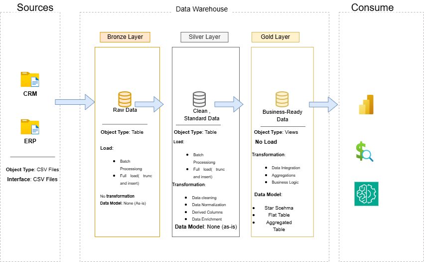
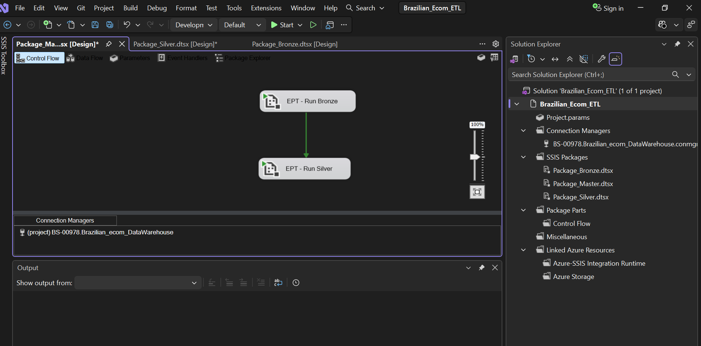
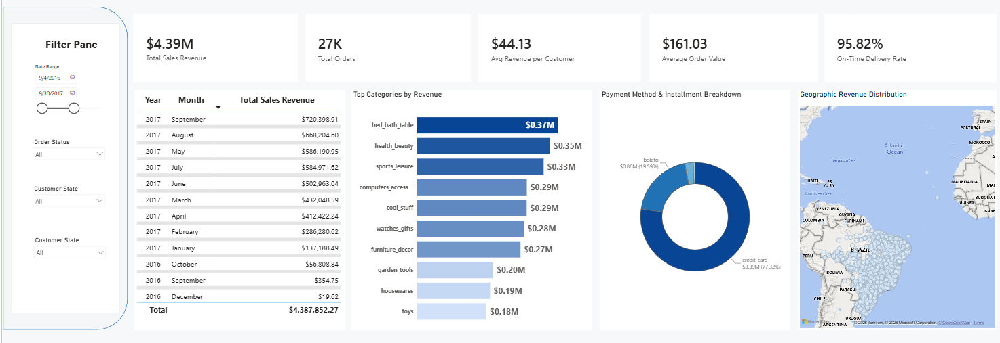

# brazilian-ecommerce-dwh
# Data Warehouse and Analytics Project

Building a modern data warehouse with SQL Server — including a T-SQL ETL pipeline, an SSIS ETL pipeline, automated job scheduling, data modeling, and a Power BI analytics layer.

Welcome to the **Data Warehouse and Analytics Project** repository! 🚀
This project demonstrates a comprehensive data warehousing and analytics solution, from building a data warehouse to generating actionable insights. Designed as a portfolio project, it highlights industry best practices in data engineering and analytics.

## 🧰 Tech Stack

`SQL Server` · `T-SQL` · `SSIS (SQL Server Integration Services)` · `SQL Server Agent` · `Power BI` · `Tableau`

---

## Data Architecture



The data architecture for this project follows Medallion Architecture: **Bronze**, **Silver**, and **Gold** layers:

1. **Bronze Layer**: Stores raw data as-is from the source systems. Data is ingested from CSV files into the SQL Server database.
2. **Silver Layer**: This layer includes data cleansing, standardization, and normalization processes to prepare data for analysis.
3. **Gold Layer**: Houses business-ready data modeled into a star schema required for reporting and analytics.

---

## 🛠️ Data Engineering (Building the Data Warehouse)

### 🎯 Objective

To develop a centralized data warehouse that consolidates disparate sales data, enabling reliable analytical reporting and business intelligence.

### 📋 Specifications & Scope

- **Data Sources:** Ingestion and integration of data from two distinct source systems provided as CSV files:
  - **ERP (Enterprise Resource Planning):** Core transactional and operational sales data.
  - **CRM (Customer Relationship Management):** Customer profiles and interaction data.
- **Data Quality & Cleansing:** Implementation of preprocessing pipelines to identify, cleanse, and resolve data quality issues (e.g., missing values, duplicates, formatting inconsistencies) prior to loading into the final model.
- **Integration & Modeling:** Merging both sources into a unified, optimized data model tailored specifically for analytical queries.
- **Scope Limitation:** Focused strictly on the **latest dataset only**. Historization (SCDs / tracking historical changes) is explicitly out of scope for this phase.
- **Documentation:** Comprehensive documentation of the final data model schemas to support both business stakeholders and downstream analytics teams.

The T-SQL implementation of this pipeline (DDL, load procedures, and transformations for all three layers) lives in [`scripts/`](scripts).

---

# 🔄 ETL Orchestration with SSIS

To complement the T-SQL scripts, this project also includes an SSIS (SQL Server Integration Services) implementation of the same ETL logic, built in Visual Studio.

**Package structure:**

- **Bronze layer:** `Package_Bronze.dtsx` loads raw data from multiple flat files (Customers, Geolocation, OrderItems, OrderPayments, OrderReviews, Orders, Products, Sellers, CategoryTranslation) into the Bronze staging tables. It includes truncate tasks to ensure idempotent loads.
- **Silver layer:** `Package_Silver.dtsx` applies transformations, data cleansing, and business logic (e.g., category translation, joins) to the Bronze data, then loads the curated results into the Silver schema.
- **Master control flow:** `Package_Master.dtsx` orchestrates the full pipeline by executing `Package_Bronze.dtsx` followed by `Package_Silver.dtsx`, providing a single entry point for the entire Bronze → Silver ETL process.

All packages use project‑level connection managers (including the Azure SQL Database connection and flat file connections for each source) and are designed for deployment on **Azure‑SSIS Integration Runtime** within Azure Data Factory, enabling cloud‑native scheduling, logging, and monitoring.
📁 [View SSIS project](ssis/Brazilian_Ecom_ETL)



---

## ⏱️ Job Scheduling (SQL Server Agent)

The end-to-end load is automated using a SQL Server Agent job, so the warehouse refreshes on a schedule without manual intervention.

- **Job:** executes the master SSIS package (`master_load_all.dtsx`) to run the full Bronze → Silver load.
- **Schedule:** *( daily at 2:00 PM)*
- **Job scripts:** the job definition is scripted out as `.sql` and version-controlled , so the schedule and steps are reproducible from source control rather than only living inside SSMS.

---

# E-Commerce Performance & Analytics Dashboard

An end-to-end **Power BI** analytics dashboard built to analyze e-commerce business operations, sales performance, delivery efficiency, and product catalog matrices using the Brazilian E-Commerce dataset structure (Olist).

## 📊 Features & Visualizations

- **KPI Highlights** – Instant metrics for Total Revenue, Total Orders, Average Order Value (AOV), Avg Review Score, and On-Time Delivery Rate %.
- **Product Performance Matrix (Scatter Plot)** – A 4-quadrant scatter chart categorizing products into High/Low Price vs High/Low Volume using dynamic reference lines.
- **Geographic & Regional Breakdown** – State-level ranking showing customer concentration and total sales revenue.
- **Order & Review Analytics** – Distribution of customer review scores alongside On-Time vs Delayed delivery breakdown.
- **Interactive Slicers** – Universal date range picker, order status filters, and regional slicers to dynamically update data views.

## 🛠️ Data Architecture & Modeling

The project utilizes a **Star Schema** data model consisting of 6 relational tables:

| Table Type | Table Names |
|------------|-------------|
| **Fact Tables** | `gold_fact_order_Dataset`<br>`gold_fact_order_items`<br>`gold_fact_order_payments` |
| **Dimension Tables** | `gold_dim_customers`<br>`gold_dim_products`<br>`gold_dim_sellers` |

## 🚀 How to Open the Dashboard

1. Download or clone this repository.
2. Open **Microsoft Power BI Desktop**.
3. Open the `.pbix` file included in the repository.


## 🔧 Requirements

- **Microsoft Power BI Desktop** (latest version recommended)
- Windows OS (Power BI Desktop is Windows-only)

## 📁 Data Source

This dashboard is based on the [Brazilian E-Commerce Public Dataset by Olist](https://www.kaggle.com/datasets/olistbr/brazilian-ecommerce). The data has been transformed and modeled to fit the star schema design.

---

Enjoy exploring your e-commerce insights! 📈
🔗 [View live Power BI report](https://app.powerbi.com/groups/me/reports/a5bc4ccc-82e2-4226-8bdd-d0760c0a6c64/9855483420e083251d64?experience=power-bi)



---

## 📊 Tableau Dashboard

A complementary Tableau dashboard is also available, built on top of the same Gold layer data model.

🔗 [View live Tableau dashboard](https://public.tableau.com/views/Datawarehousedashboard/Dashboard1?:language=en-US&publish=yes&:sid=&:redirect=auth&:display_count=n&:origin=viz_share_link)

---

## 📂 Repository Structure

```
sql_data_warehouse_project/
├── datasets/              # Raw source CSV files (ERP & CRM)
├── docs/                  # Architecture diagrams & README screenshots
│   └── screenshots/
├── scripts/                # T-SQL DDL and ETL scripts (Bronze, Silver, Gold)
├── tests/                  # Data quality checks
├── ssis/
│   └── DataWarehouse_ETL/  # Visual Studio SSIS solution & .dtsx packages
├── sql_agent/
│   └── job_scripts/        # Scripted SQL Server Agent job definitions
├── powerbi/
│   └── sales_dashboard.pbix
├── LICENSE
└── README.md
```

---

## License

This project is licensed under the [MIT License](LICENSE).
